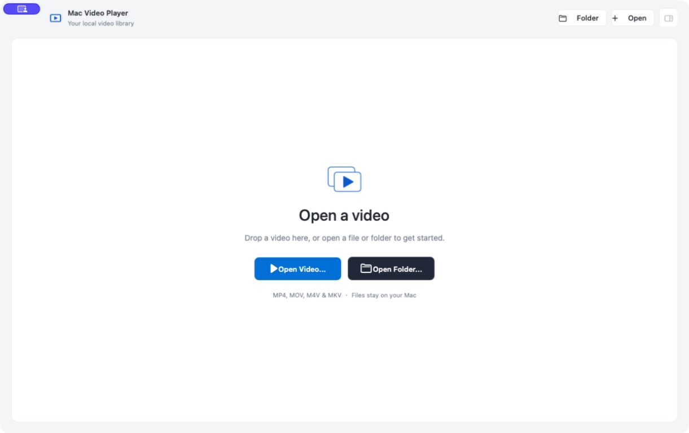
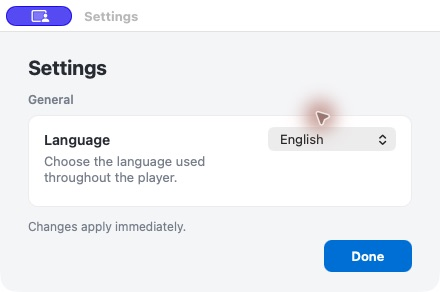

# Mac Video Player

> A clean, native macOS player for local video libraries, with tags, playlists, and familiar keyboard controls.

[English](README.md) · [简体中文](README.zh-CN.md)

<p align="center">
  
</p>

Mac Video Player keeps local viewing simple: open a video or folder, browse the generated playlist, organize files with tags, and play without changing the original media.

## Highlights

- **Native light appearance** — a calm macOS-style interface with a large video canvas and a circular play/pause button.
- **Local libraries** — open an MP4, MOV, M4V, or MKV file, or scan a folder to build a playlist automatically.
- **Collapsible playlist** — hide the playlist with the sidebar button to give the video more room, then restore it without losing the current selection.
- **Tags that stay local** — add, remove, and filter tags from the player or the tag editor. Tags are stored separately as JSON and never modify the media file.
- **English and Simplified Chinese** — choose the interface language in **Mac Video Player > Settings…**. The change applies immediately and is remembered.
- **Playback controls** — sequential or shuffle playback, timeline seeking, volume control, Previous and Next, drag-and-drop opening, Finder reveal, and screenshot capture.
- **Faster long seeks** — Left and Right Arrow seek by five seconds. Hold either key for more than five seconds to increase each repeated seek by 150% (12.5 seconds per repeat).

## Language settings

<p align="center">
  
</p>

Open **Mac Video Player > Settings…**, select **English** or **简体中文**, and close the window with **Done**. Menus, controls, playlist labels, tag controls, and alerts refresh immediately.

## Controls

| Input | Action |
| --- | --- |
| `Space` | Play or pause |
| `Up Arrow` / `Down Arrow` | Previous or next video |
| `Left Arrow` / `Right Arrow` | Seek backward or forward 5 seconds |
| Hold `Left Arrow` / `Right Arrow` for over 5 seconds | Seek 12.5 seconds per repeated key event |
| Scroll over the video | Previous or next video |
| Scroll over the volume slider | Adjust volume |

The playlist panel keeps its own normal scrolling. Use the sidebar toggle in the upper-right corner of the player to collapse or reopen it.

## Tags

Type a tag in the **Add tag** field and press Return or choose **Add**. The field stays editable while playback state updates, including during input-method composition. Select a tag from the playlist filter to show matching files only.

Tags are stored at:

```text
~/Library/Application Support/MacVideoPlayer/tags.json
```

## Build

### Requirements

- macOS 13.0 or later
- Swift 6 and the macOS Command Line Tools
- The IINA/libmpv runtime in `Vendor/IINAFrameworks`

If the runtime is absent, install IINA and import its Frameworks directory:

```sh
./scripts/fetch-iina-runtime.sh
```

Set `IINA_APP` if IINA is installed outside `/Applications/IINA.app`:

```sh
IINA_APP="/path/to/IINA.app" ./scripts/fetch-iina-runtime.sh
```

Build the app bundle:

```sh
./scripts/build-app.sh
```

The bundle is written to `build/MacVideoPlayer.app`. Create a DMG with:

```sh
./scripts/build-dmg.sh
```

## Verification

Run the Swift tests when XCTest is available:

```sh
swift test
```

The core regression checks work with the Command Line Tools alone:

```sh
python3 scripts/test-regressions.py
```

They cover language persistence, tag entry and input-method behavior, playlist filtering and ordering, keyboard seek acceleration, playback events, command serialization, screenshot paths, and clean DMG staging without opening a player window or decoding media.

Performance regressions also cover background tag writes, concurrent edits and failure recovery, skipped unchanged saves, cached sort orders, scan cancellation, deletion during scanning, and paused progress updates. If an OpenGL pixel format is unavailable, the script reports the hidden-window input checks as skipped and continues with the core checks.

## Runtime and license

The packaged application includes IINA/libmpv and related media dependencies. It decodes the original file directly, supports hardware decoding where available, and does not remux or transcode media.

Because distributed builds include the IINA/libmpv runtime, this project is licensed under the GNU General Public License v3.0. Keep the corresponding source and third-party notices available when redistributing.

- [LICENSE](LICENSE)
- [Third-party notices](THIRD_PARTY_NOTICES.md)
- Upstream IINA source reference: `ThirdParty/IINA` at commit `db549a6`

Mac Video Player is not affiliated with or endorsed by IINA, FFmpeg, VLC, Sparkle, or Apple.
